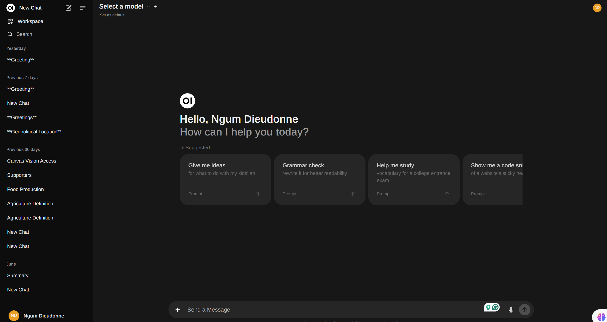

# Final Semester Project

This project involves setting up WSL, installing Docker, running an Open WebUI Docker container, and installing Stable Diffusion. Follow the steps below to set up each component.

## Table of Contents
1. [Setup WSL and Ubuntu](#setup-wsl-and-ubuntu)
2. [Install Ollama](#install-ollama)
3. [Watch GPU Performance](#watch-gpu-performance)
4. [Install Docker](#install-docker)
5. [Run Open WebUI Docker Container](#run-open-webui-docker-container)
6. [Install Stable Diffusion](#install-stable-diffusion)

## Setup WSL and Ubuntu

### Install WSL and Ubuntu

```bash
wsl --install
Connect to a WSL Instance in a new window
wsl -d Ubuntu

Final Semester Project
This project involves setting up WSL, installing Docker, running an Open WebUI Docker container, and installing Stable Diffusion. Follow the steps below to set up each component.
Table of Contents
Setup WSL and Ubuntu
Install Ollama
Watch GPU Performance
Install Docker
Run Open WebUI Docker Container
Install Stable Diffusion

Setup WSL and Ubuntu
Install WSL and Ubuntu

wsl --install


Connect to a WSL Instance in a new window

wsl -d Ubuntu


Install Ollama
Download and Install Ollama
Follow the instructions on Ollama's official website.
Add a Model to Ollama

ollama pull llama2


Watch GPU Performance
Monitor GPU Performance in Linux

watch -n 0.5 nvidia-smi


Install Docker
Add Docker's official GPG key

sudo apt-get update
sudo apt-get install ca-certificates curl
sudo install -m 0755 -d /etc/apt/keyrings
sudo curl -fsSL https://download.docker.com/linux/ubuntu/gpg -o /etc/apt/keyrings/docker.asc
sudo chmod a+r /etc/apt/keyrings/docker.asc


Add the repository to Apt sources

echo \
"deb [arch=$(dpkg --print-architecture) signed-by=/etc/apt/keyrings/docker.asc] https://download.docker.com/linux/ubuntu \
$(. /etc/os-release && echo "$VERSION_CODENAME") stable" | \
sudo tee /etc/apt/sources.list.d/docker.list > /dev/null
sudo apt-get update


Install Docker

sudo apt-get install docker-ce docker-ce-cli containerd.io docker-buildx-plugin docker-compose-plugin


Run Open WebUI Docker Container
Run the Open WebUI Docker Container

docker run -d --network=host -v open-webui:/app/backend/data -e OLLAMA_BASE_URL=http://127.0.0.1:11434 --name open-webui --restart always ghcr.io/open-webui/open-webui:main


Install Stable Diffusion
Install Pyenv Prerequisites

sudo apt install -y make build-essential libssl-dev zlib1g-dev \
libbz2-dev libreadline-dev libsqlite3-dev wget curl llvm libncurses5-dev \
libncursesw5-dev xz-utils tk-dev libffi-dev liblzma-dev git


Install Pyenv

curl https://pyenv.run | bash


Install Python 3.10

pyenv install 3.10


Make Python 3.10 Global

pyenv global 3.10


Download and Install Stable Diffusion

wget -q https://raw.githubusercontent.com/AUTOMATIC1111/stable-diffusion-webui/master/webui.sh
chmod +x webui.sh
./webui.sh --listen --api

